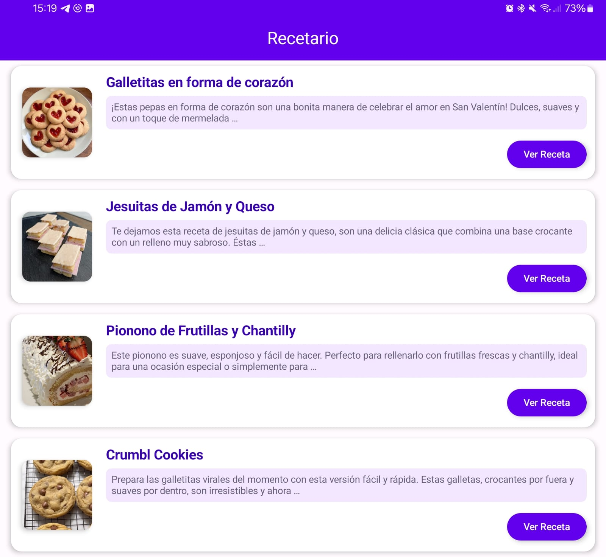
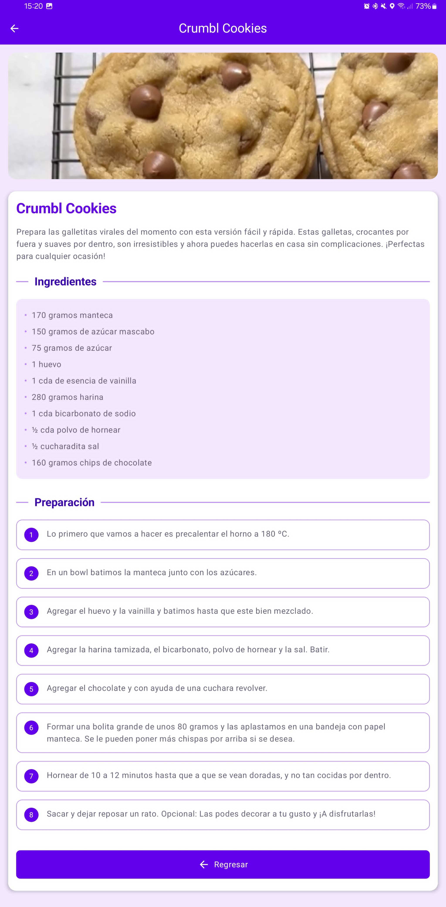
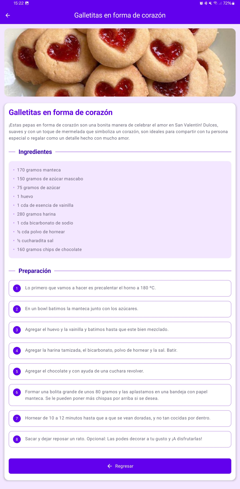

# 🍳 AppRecetario - Android App

Este proyecto es una aplicación móvil desarrollada en **Kotlin** con **Jetpack Compose** que ofrece un recetario interactivo. La app cuenta con un diseño atractivo, funcionalidad intuitiva y está optimizada para brindar una experiencia agradable al usuario.

## 📁 Estructura del Proyecto

- **components**: Componentes reutilizables de UI.
- **navigation**: Gestión de navegación entre vistas utilizando Jetpack Navigation.
- **views**: Interfaces principales para visualizar recetas y menú.

## 🚀 Funcionalidades Principales

- Visualización atractiva de recetas con imágenes, ingredientes y pasos detallados.
- Navegación fluida entre el menú principal y las recetas individuales.
- Diseño moderno y responsive con Jetpack Compose.

## 🛠️ Componentes

### 📌 BarComponents
- `TitleBar`: Barra superior para títulos personalizados.
- `ActionButton`: Botón flotante para acciones como "Regresar" con ícono y texto.

### 📌 BodyComponents
- `TitleView`: Título estilizado para secciones.
- `MainButton`: Botón personalizado con colores configurables.
- `RecipeCard`: Tarjeta interactiva que muestra imagen, descripción corta y botón para ver detalles de recetas.
- `SectionTitle`: Componente para títulos de secciones, con estilo elegante.

## 🧭 Navegación

La navegación se maneja usando **Jetpack Navigation**, permitiendo pasar datos de recetas mediante JSON codificado, garantizando una experiencia de usuario fluida y eficiente.

### 📌 Rutas implementadas:

- **Home** (`MenuView`): Muestra el listado de recetas.
- **Receta individual** (`RecipeView`): Muestra detalles completos de la receta seleccionada.

## 🎨 Diseño

Se utiliza una paleta de colores basada en tonos morados que brinda un aspecto moderno y limpio:

- `#6200EE` (Primary Purple)
- `#3700B3` (Deep Purple)
- `#BB86FC` (Light Purple)
- `#F2E7FE` (Fondo muy claro morado)

Los componentes visuales utilizan esquinas redondeadas, sombras y efectos visuales sutiles para mejorar la experiencia del usuario.

## ⚙️ Estructura del Proyecto

```
com.example.apprecetario
├── components
│   ├── BarComponents.kt
│   └── BodyComponents.kt
├── navigation
│   └── NavManager.kt
├── views
│   ├── MenuView.kt
│   └── RecipeView.kt
└── MainActivity.kt
```

## 📱 Cómo Usar

1. Clona este repositorio:

```bash
git clone <URL_DEL_REPOSITORIO>
```

2. Abre el proyecto con **Android Studio**.
3. Ejecuta la app en un dispositivo o emulador compatible.

## 📸 Capturas de Pantalla

<div align="center">
    <h3>Menu View</h3>
    
</div>

<div align="center">
    <h3>Recipe View</h3>
    
    
</div>

## 🛠️ Tecnologías

- Kotlin
- Jetpack Compose
- Android Jetpack (Navigation)